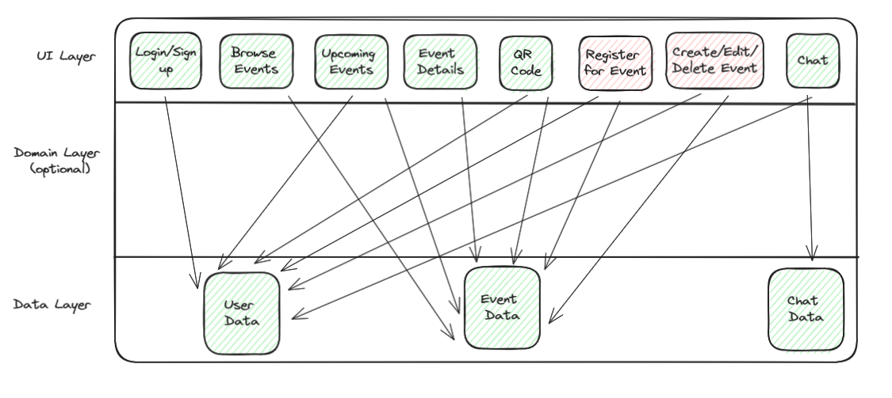

# event-radar-app
Holds all the code for the Android app, Event Radar (see the demo).

TODO: Add demo

## Overview of functionalities

Event Radar is an innovative app designed to effortlessly facilitate connections among individuals by streamlining event discovery, registration, and networking in one place. It allows users to discover and register for upcoming events in their local area, enabling them to connect seamlessly with friends and new acquaintances they meet during the event. Event hosts can easily create and manage events while leveraging the app's unique QR code system to scan tickets and easily interact with event attendees.

### Features

- **Event Discovery:** Effortlessly find events based on your interests and location and view their position on the map.

- **Easy Registration:** Register for events with just a few taps.

- **Networking:** Connect with new friends and save their contact information by scanning QR codes.

- **Messaging:** Continue the conversation with new acquaintances after the event.

- **Event Hosting:** Create and manage events with robust tools for ticketing and attendee tracking.

- **Quick verification:** Scan attendees' QR codes to confirm their presence on the event's participant list.


### Testing

The code is thoroughly tested, achieving more than 80% line coverage across our features with several hundred tests. Each screen displayed to users is covered by an Android UI test, ensuring the interface works correctly. Additionally, numerous unit tests verify the functionality of individual components. We also conduct end-to-end tests to ensure a smooth and accurate user flow, providing an optimal user experience.

### Running the App

Download the built debug APK on your android phone from the release branch M4.


## Packages structure

Here is a description of the most important packages in the main folder. We have clearly separated frontend Ui from backend functionalities and data interactions, following Model View ViewModel (MVVM) architecture.

- **Model** holds all the model for our app such as event, user, messages and the differents repositories to interact with the database.

  - **di** is used to store the setup files for data dependencies injection using Hilt.

  - **repository** holds the repositories used to bridge between the data source and the rest of the app. It contains repositories for : event, users, messages, and location. In our case we are working the Firebase and Nominatim.

- **Ui** sort all the kotlin files containing our composable function to display the ui. It is built using Jetpack Compose Material3. 

  - **component** contains a set of reusable UI elements to facilitate code maintenance and ensure a consistent look throughout the app.

  - all other packages named after our screens

- **ViewModel** contains all our viewModels used in the app. ViewModels manage the data for the UI components, handling logic and surviving configuration changes, based on the Model View ViewModel design. 


## Figma
[Figma Link](https://www.figma.com/file/yCDFrt0sOYFhXlYlWp8sZT/Party-Radar-App?type=design&node-id=0%3A1&mode=design&t=XbCBmVxvjFARZu1n-1)  
[Figma Dev Mode Link](https://www.figma.com/file/yCDFrt0sOYFhXlYlWp8sZT/Party-Radar-App?type=design&node-id=0%3A1&mode=dev&t=XbCBmVxvjFARZu1n-1)

## Architecture Diagram

[Image Link](https://excalidraw.com/#json=uxX_PSsRBwFp7eaKhFoPi,OxY6p3xsK6sxxUXAxedKAw)
_revised 28/5/2024_

## Backend
### Users database
The structure of the user database is as follows:
```json
{
  "users": {
    "user_id": {
      "private": {
        "private_id": {
          "birthdate": "31/12/1999",
          "email": "christineha127@gmail.com",
          "firstName": "Christine",
          "lastName": "Ha",
          "phoneNumber": "0779642510"
        }
      },
      "public": {
        "public_id": {
          "accountStatus": "active",
          "eventsAttendeeList": ["event_id1", "event_id2"],
          "eventsHostList": ["event_id1", "event_id2"],
          "friendsList": ["user_id1", "user_id2"],
          "profilePicUrl": "https://stackoverflow.com/questions/46585330/firestore-security-rules-for-public-and-private-fields",
          "qrCodeUrl": "https://stackoverflow.com/questions/46585330/firestore-security-rules-for-public-and-private-fields",
          "username": "chaha"
        }
      }
    }
  }
}
```
Note:
- Private and public collection created to manage permissions access using this link: https://stackoverflow.com/questions/46585330/firestore-security-rules-for-public-and-private-fields
    - Check Firestore rules for more information / details
- Images should be stored in Firebase Storage ( firebase_storage ) to upload the image file and then you store the download url of the image inside the document in the Cloud Firestore ( cloud_firestore ).

### Events database
The structure of the event database is as follows:

 ```json
{
  "events": {
    "event_id": {
      "name": "New Years Eve Party",
      "photo_url": "https://stackoverflow.com/questions/46585330/firestore-security-rules-for-public-and-private-fields",
      "description": "Get Ready for NYE 2025, dress classy and dance all night",
      "category": "MUSIC",
      "start": "31/12/2024 23:00:00",
      "end": "01/01/2025 06:00:00",
      "location": {
        "location_name": "Starling Hotel",
        "location_lat": 19.4783892,
        "location_lng": 192.198489
      },
      "ticket": {
        "ticket_name": "Standard",
        "ticket_price": 20.00,
        "ticket_capacity": 450,
        "ticket_purchases": 0
      },
      "main_organiser": "xu378csh",
      "organisers_list": [
        "xu378csh",
        "qwglei7"
      ],
      "attendees_list": [
        "xu378csh",
        "qwglei7",
        "bfndn3"
      ]
    }
  }
}
```
Field Definitions:
- Ticket capacity refers to the maximum number of tickets sold by the event host.
- Ticket purchases refers to the number of ticket purchases made so far by event attendees.
Note:
- Co-Organiser list: List of references (in Firebase).  
       
### Messages (Chat) Database
The structure of the Messages database is as follows:
```json
{
  "messages": {
    "message_history_id": {
      "from_user": "xu378csh",
      "to_user": "qwglei7",
      "from_user_read": true,
      "to_user_read": false,
      "latest_message_id": "ortz34k39",
      "messages_list": [
        {
          "message_id": {
            "sender": "qwglei7",
            "content": "message here",
            "date_time_sent": "31/12/2024 23:00:00"
          }
        }
      ]
    }
  }
}
```         
Note:
- each document in `messages` holds information about a conversation between two users
